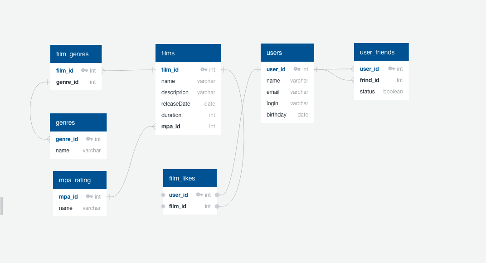

# java-filmorate

## Модель базы данных представлена на ER-диаграмме

## Примеры запросов в базу данных
Получить фильм с id=2:

`SELECT *
FROM films
WHERE film_id = 2;`

Получить пользователя с id=5

`SELECT *
FROM users
WHERE user_id = 5;`

